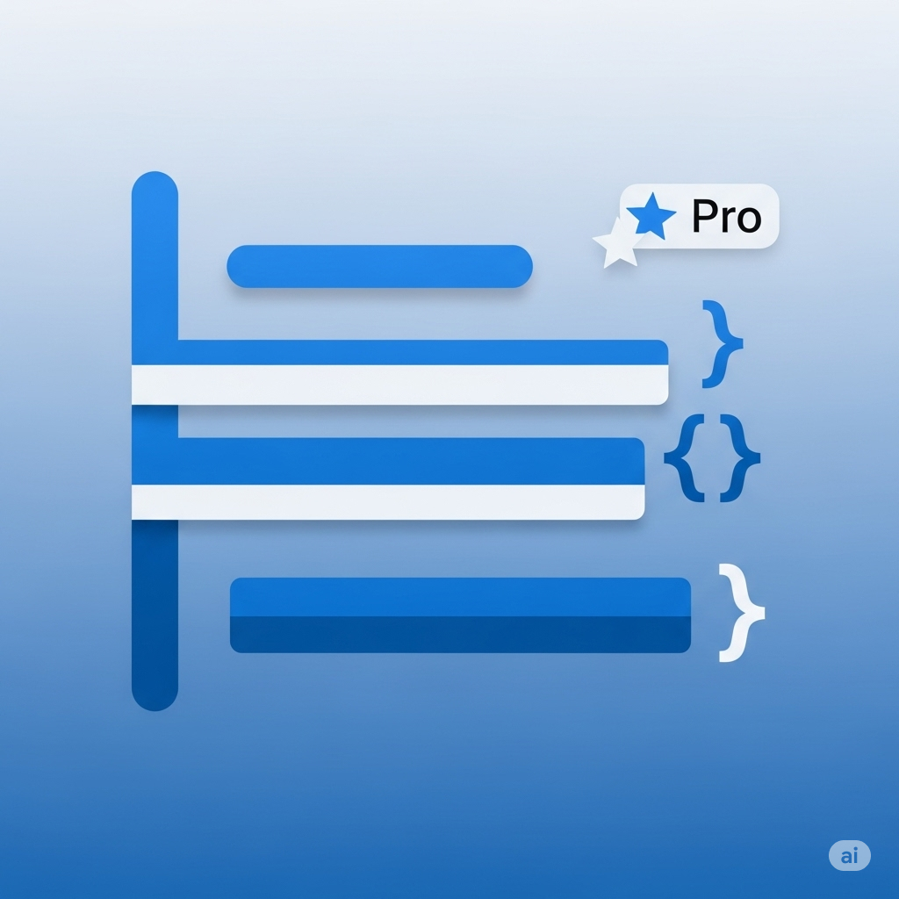
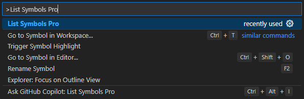

# List Symbols Pro



An enhanced version of the List Symbols extension that lists all symbols in a code file as plain text using VS Code's built-in symbol processing capabilities, with added support for return type detection.

Simply run `Ctrl + Shift + P` -> `List Symbols Pro`



and you will get output like the following in a new tab with **enhanced return type detection**:

**For Dart code:**
```
class NotificationService
	field _firebaseMessaging
	field _invitationService
	field _friendshipService
	method initialize: Future<void>
	method _requestNotificationPermissions: Future<NotificationSettings>
	method _setupFcmToken: Future<void>
	method _configureForegroundNotificationHandler
	method _configureBackgroundNotificationHandler
	method _configureTokenRefreshListener
	method _handleNotification
	method _getNotificationType
	method navigateToAcceptInvitationPage
	method navigateToFriendRequestsPage
	method navigateToFriendsPage
	method navigateToHome
	method updateUserActivity: Future<void>
```

**For JavaScript/TypeScript code:**
```
class Calculator
	constructor constructor
	method appendNumber
	method chooseOperation
	method clear
	method compute
		variable computation
		variable current
		variable prev
	method delete
	method getDisplayNumber
		variable decimalDigits
		variable integerDigits
		variable integerDisplay
		property maximumFractionDigits
		variable stringNumber
	method updateDisplay
```

## Features

- **Return Type Detection**: Automatically detects and displays return types for methods and functions
- **Multi-Language Support**: Works with Dart, TypeScript, JavaScript, Java, C#, and more
- **Privacy Modifier Detection**: Shows public/private visibility for class members
- **Nested Symbol Support**: Displays hierarchical structure with proper indentation

## List All Symbols in Folder

You can right-click a folder and select `List All Symbols in Folder Pro` to get a combined output of all files in that folder, including return types for all detected methods.

## Supported Languages

- **Dart**: Full support including `Future<T>`, `Stream<T>`, and other generic return types
- **TypeScript**: Method signature return types (`: ReturnType`)
- **JavaScript**: Basic function detection
- **Java/C#**: Public/private method return types
- **And more**: The extension uses VS Code's symbol provider, so it works with any language that supports symbol detection

---

*This is an enhanced fork of the original [List Symbols](https://github.com/jmbeach/vscode-list-symbols) extension by jmbeach, with added return type detection and improved language support.*
